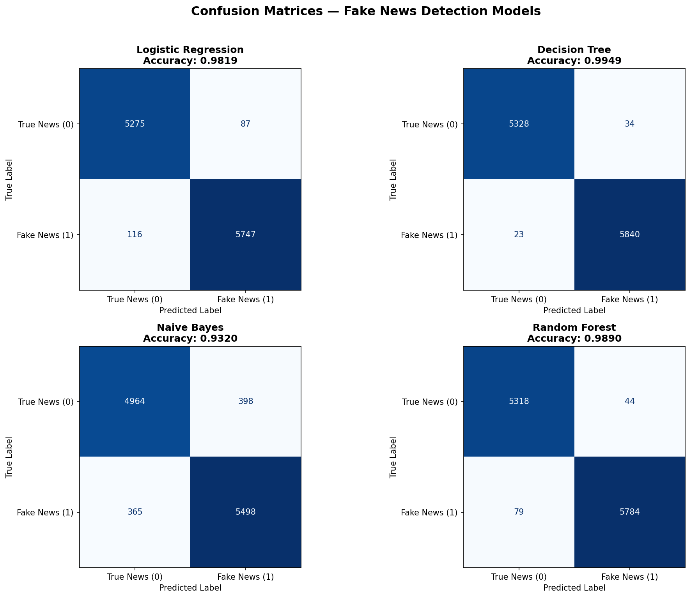
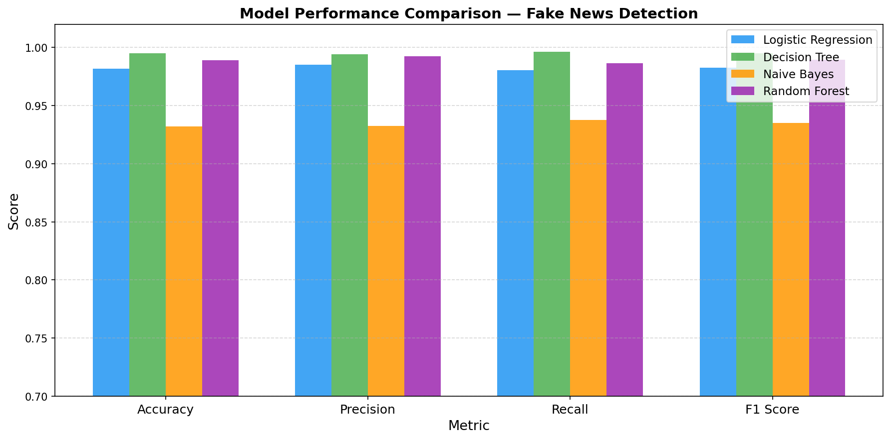

<div align="center">


<br/><br/>

# 🕵️‍♂️ Fake News Detection & Evaluation with Confusion Matrix

<h3>IDEAS Summer Internship Program 2026</h3>
<h4>Institute of Data Engineering, Analytics and Science Foundation</h4>

<br/>

> **"Can a machine tell real news from fake? This project proves it can — with 99.49% accuracy."**

<br/>

[](https://github.com/ADARSH685-BOT/04-Fake_News_Detection_and_Evaluation_with_Confusion_Matrix_Spring_2026.ipynb)
[](https://www.kaggle.com/datasets/emineyetm/fake-news-detection-datasets)

</div>

---

## 📋 Table of Contents

- [Project Overview](#-project-overview)
- [Dataset](#-dataset)
- [Methodology](#-methodology)
- [Preprocessing](#-text-preprocessing)
- [Models Trained](#-models-trained)
- [Results](#-results)
- [Confusion Matrix](#-confusion-matrix)
- [Repository Structure](#-repository-structure)
- [How to Run](#-how-to-run)
- [Tech Stack](#-tech-stack)
- [Notebook Structure](#-notebook-structure)
- [Author](#-author)

---

## 📌 Project Overview

Misinformation and fake news are a growing threat to public discourse. This project builds a complete **end-to-end NLP machine learning pipeline** to automatically classify news articles as **Real (0)** or **Fake (1)** using classical ML models trained on ~45,000 labeled articles.

The pipeline covers:
- Raw text ingestion from two labeled CSV files
- Text cleaning and normalisation
- TF-IDF feature extraction
- Training and comparing 4 classification models
- Hyperparameter tuning with GridSearchCV
- Full evaluation with Accuracy, Precision, Recall, F1 Score
- Confusion matrix visualisation for all models

---

## 📊 Dataset

| Property | Details |
|----------|---------|
| **Source** | [Kaggle — Fake News Detection Datasets](https://www.kaggle.com/datasets/emineyetm/fake-news-detection-datasets) |
| **Files** | `Fake.csv` + `True.csv` |
| **Total Articles** | 44,898 |
| **Fake Articles** | 23,481 — sourced from Politifact-identified unreliable sites |
| **True Articles** | 21,417 — sourced from Reuters.com |
| **Topic Focus** | Politics & World News |
| **Raw Columns** | `title`, `text`, `subject`, `date` |
| **Label Column** | `class` → `1` = Fake, `0` = True (created during preprocessing) |
| **Text Feature** | `text` (article body) |
| **Missing Values** | None |

> ⚠️ **Dataset not included** in this repo. Download from Kaggle and place `Fake.csv` + `True.csv` in a `News_dataset/` folder.

---

## 🏗️ Methodology

```
┌─────────────────────────────────────────────────────────────────┐
│                     PROJECT PIPELINE                            │
├─────────────────────────────────────────────────────────────────┤
│                                                                 │
│  Fake.csv (23,481)  +  True.csv (21,417)                       │
│          │                                                      │
│          ▼                                                      │
│   Label Encoding  →  class: 1 (Fake) | 0 (True)               │
│          │                                                      │
│          ▼                                                      │
│   Merge + Shuffle  →  44,898 rows combined                     │
│          │                                                      │
│          ▼                                                      │
│   Data Cleaning  →  Keep only 'text' + 'class'                 │
│          │                                                      │
│          ▼                                                      │
│   wordopt() Preprocessing                                       │
│     • Lowercase  • Remove URLs                                  │
│     • Remove non-alphanumeric  • Collapse whitespace           │
│          │                                                      │
│          ▼                                                      │
│   TF-IDF Vectorisation  →  104,782 features                    │
│          │                                                      │
│          ▼                                                      │
│   Train/Test Split  →  75% train | 25% test                    │
│          │                                                      │
│          ▼                                                      │
│  ┌───────────────────────────────────────┐                     │
│  │  4 Models Trained & Evaluated         │                     │
│  │  ① Logistic Regression                │                     │
│  │  ② Decision Tree                      │                     │
│  │  ③ Naive Bayes                        │                     │
│  │  ④ Random Forest                      │                     │
│  └───────────────────────────────────────┘                     │
│          │                                                      │
│          ▼                                                      │
│   GridSearchCV Hyperparameter Tuning (Logistic Regression)     │
│          │                                                      │
│          ▼                                                      │
│   Confusion Matrix + Full Metrics Report                       │
│                                                                 │
└─────────────────────────────────────────────────────────────────┘
```

---

## 🧹 Text Preprocessing

The `wordopt(text)` function applies 4 cleaning steps to every article:

```python
def wordopt(text):
    text = text.lower()                              # 1. Lowercase
    text = re.sub(r'https?://\S+|www\.\S+', ' ', text)  # 2. Remove URLs
    text = re.sub(r'[^a-z0-9]', ' ', text)          # 3. Remove non-alphanumeric
    text = re.sub(r'\s+', ' ', text).strip()         # 4. Collapse whitespace
    return text
```

**Before:** `"Donald Trump just couldn't wish all Americans... https://t.co/xyz"`  
**After:** `"donald trump just couldn t wish all americans"`

---

## 🤖 Models Trained

| # | Model | Key Parameters |
|---|-------|---------------|
| 1 | **Logistic Regression** | `max_iter=1000`, `random_state=42` |
| 2 | **Decision Tree** | `random_state=42` |
| 3 | **Naive Bayes** | `MultinomialNB()` |
| 4 | **Random Forest** | `n_estimators=100`, `random_state=42` |

**Hyperparameter Tuning (GridSearchCV):**
```python
param_grid = {'C': [0.1, 1, 10], 'solver': ['liblinear', 'lbfgs']}
# Best result → {'C': 10, 'solver': 'liblinear'}
```

---

## 📈 Results

| Model | Accuracy | Precision | Recall | F1 Score |
|-------|:--------:|:---------:|:------:|:--------:|
| Logistic Regression | 0.9819 | 0.9851 | 0.9802 | 0.9826 |
| 🏆 **Decision Tree** | **0.9949** | **0.9942** | **0.9961** | **0.9951** |
| Naive Bayes | 0.9320 | 0.9325 | 0.9377 | 0.9351 |
| Random Forest | 0.9890 | 0.9925 | 0.9865 | 0.9895 |

### 🏆 Best Model: Decision Tree (F1 = 0.9951)

Decision Tree achieved the highest F1 Score, making it the most balanced model. It correctly identifies both fake and real news with minimal false positives and false negatives. The F1 Score is used as the selection criterion because it balances Precision and Recall — critical in fake news detection where both false alarms and missed fakes carry real-world consequences.

---

## 🔲 Confusion Matrix

All four models were evaluated with confusion matrices:



| Term | Meaning |
|------|---------|
| **True Positive (TP)** | Fake news correctly identified as fake |
| **True Negative (TN)** | Real news correctly identified as real |
| **False Positive (FP)** | Real news wrongly flagged as fake |
| **False Negative (FN)** | Fake news missed, classified as real |

Model comparison bar chart:



---

## 🗂️ Repository Structure

```
📁 04-Fake_News_Detection_and_Evaluation_with_Confusion_Matrix_Spring_2026/
│
├── 📓 04-Fake_News_Detection_and_Evaluation_with_Confusion_Matrix_Spring_2026.ipynb
│       └── Complete notebook: 33 cells, all outputs included
│
├── 🖼️  confusion_matrices.png    ← Confusion matrix for all 4 models
├── 🖼️  model_comparison.png      ← Bar chart comparing all metrics
├── 🚫 .gitignore                 ← Excludes dataset CSVs
└── 📄 README.md                  ← This file
│
└── 📁 News_dataset/              ← NOT included (download from Kaggle)
    ├── Fake.csv
    └── True.csv
```

---

## 🚀 How to Run

### Step 1 — Clone the repository
```bash
git clone https://github.com/ADARSH685-BOT/04-Fake_News_Detection_and_Evaluation_with_Confusion_Matrix_Spring_2026.ipynb.git
cd "04-Fake_News_Detection_and_Evaluation_with_Confusion_Matrix_Spring_2026.ipynb"
```

### Step 2 — Install dependencies
```bash
pip install pandas scikit-learn matplotlib numpy jupyter
```

### Step 3 — Download the dataset
Download from [Kaggle](https://www.kaggle.com/datasets/emineyetm/fake-news-detection-datasets) and create:
```
News_dataset/
├── Fake.csv
└── True.csv
```

### Step 4 — Update file paths in the notebook
In **Question 1 (Cell 1)**, update the paths:
```python
fake_df = pd.read_csv('News_dataset/Fake.csv')
true_df = pd.read_csv('News_dataset/True.csv')
```

### Step 5 — Launch and run
```bash
jupyter notebook
```
Open the `.ipynb` file and run **Kernel → Restart & Run All**.

---

## 🛠️ Tech Stack

| Tool | Version | Purpose |
|------|---------|---------|
| Python | 3.10 | Core language |
| Pandas | latest | Data loading & manipulation |
| Scikit-learn | latest | ML models, TF-IDF, metrics, GridSearchCV |
| Matplotlib | latest | Visualisations & confusion matrices |
| NumPy | latest | Numerical operations |
| Jupyter Notebook | latest | Interactive development |
| re (stdlib) | — | Regex-based text cleaning |

---

## 📋 Notebook Structure

| Cell | Question | Task | Marks |
|------|----------|------|:-----:|
| 1 | Q1 | Import libraries & load `Fake.csv` + `True.csv` | 2 |
| 2 | Q2 | Add `class` label column (1=Fake, 0=True) | 1 |
| 3 | Q3 | Merge DataFrames + shuffle rows | 2 |
| 4 | Q4 | Drop `title`, `subject`, `date` → 2-column `df_clean` | 2 |
| 5 | Q5 | Define & apply `wordopt()` text preprocessing | 5 |
| 6 | Q6 | Feature/target split + `train_test_split(test_size=0.25)` | 2 |
| 7 | Q7 | TF-IDF vectorisation (fit on train, transform both) | 5 |
| 8 | Q8 | Logistic Regression + `classification_report` | 3 |
| 9 | Q9 | Decision Tree + `accuracy_score` | 3 |
| 10 | Q10 | GridSearchCV hyperparameter tuning | 5 |
| 11–13 | Extra | Naive Bayes + Random Forest training | — |
| 14 | Extra | Model comparison table + bar chart | — |
| 15 | Extra | Confusion matrix visualisation (all 4 models) | — |
| 16 | Extra | Best model selection + justification | — |
| 17 | Extra | Conclusion markdown | — |
| | | **Total Marks** | **30** |

---

## ✅ Internship Requirements Checklist

| Requirement | Status |
|-------------|:------:|
| Notebook name unchanged | ✅ |
| Correct dataset (`Fake.csv` + `True.csv`) | ✅ |
| Target column (`class`) | ✅ |
| Text feature column (`text`) | ✅ |
| Missing value handling | ✅ |
| Text preprocessing (`wordopt`) | ✅ |
| TF-IDF vectorisation | ✅ |
| Train/test split (75/25) | ✅ |
| Logistic Regression trained | ✅ |
| Naive Bayes trained | ✅ |
| Random Forest trained | ✅ |
| Accuracy, Precision, Recall, F1 Score | ✅ |
| Confusion matrix visualised | ✅ |
| Best model selected with justification | ✅ |
| Comments & markdown in every section | ✅ |
| Dataset excluded from GitHub | ✅ |

---

## 👨‍💻 Author

<div align="center">

**Adarsh Kumar**  
Summer Internship 2026 — IDEAS Foundation

[](https://github.com/ADARSH685-BOT)

</div>

---

<div align="center">

*Built with ❤️ for the IDEAS Summer Internship Program 2026*

**Notebook:** `04-Fake_News_Detection_and_Evaluation_with_Confusion_Matrix_Spring_2026.ipynb`

</div>
